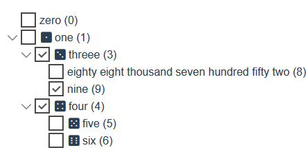
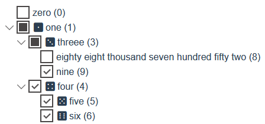

# Component Options

| Name                   | Type         |  Default  | Description |
|------------------------|:------------:|:---------:|-------------|
| **autoSort**           | Boolean   | false    | If **true** then turns on auto-sorting whenever node collection is changed |
| **canDelete**           | Boolean   | false   | Allows to delete a selected node by using the **Del** key |
| **canEdit**           | Boolean   | false   | Allows to edit a selected node caption [See below](#Edit-node-caption) |
| **checkMode**      | String   | 'independent'   | Multiselection mode for checkboxes. Can be either `independent` or `linked`. [See below](#Check-mode) |
| **checkOnSelect**  | Boolean   | false | If **true** when a node is selected it is also checked |
| **childrenProp**| String | 'children'    | Indicates a prop in `items` that contains an array of an underlying items. |
| **hideEmptyIcon**       | Boolean   | true | Allows to collapse the space occupied by an empty icon before a node caption |
| **icons** | Object| icons.defaultIcons | Contains classes for different node states. [See below](#Node-State-Icons) |
| **idProp**      | String    | 'id'       | Indicates a prop that uniquely identifies every node. [See below](#Node-Identification) |
| **nameProp**      | String &#124; Function | 'name' | Indicates a prop or a function that will be used to show the node caption. [See below](#Node-Caption) |
| **editNameProp**      | String &#124; Function | nameProp | Indicates a prop or a function that will be used to change the node caption. [See below](#Edit-node-caption) |
| **notFoundText**         | String | 'no nodes are found' | Indicates a text that will be shown when after node filtering no nodes ae shown. See [filtering](#Filtering) |
| **openOnSelect**         | Boolean | false | If **true** when a node is selected it is also will be open |
| **showCheckbox**         | Boolean | true | Allows to turn on multiselection mode by showing checkboxes for every node |
| **showIcon**         | Boolean | false | Allows to show icons for every node. [See below](#Node-State-Icons) |
| **sortComparator**   | Function | String.prototype.localeCompare | Function that is used to sort nodes by their captions. See [sort](#Sort) |
| **styleClasses** | Object || Contains default classes for different visual node parts of all nodes. [See below](#Default-Node-Style-Classes) |
| **styleClasses.checkbox** | String &#124; Object | null | Contains class(es) that is added to node checkbox classes. [See below](#Node-Style-Classes) |
| **styleClasses.expander** | String &#124; Object | null | Contains class(es) that is added to node expander classes. [See below](#Node-Style-Classes) |
| **styleClasses.icon** | String &#124; Object | null | Contains class(es) that is added to node icon classes. [See below](#Node-Style-Classes) |
| **styleClasses.text** | String &#124; Object | null | Contains class(es) that is added to node text classes. [See below](#Node-Style-Classes) |

## Edit node caption
The edit mode are turned on by setting `options.canEdit=true`. To start editing a selected node press the **F2** key or perform **double-click** on the node caption.
By default the prop of a node that is indicated in `options.nameProp` will be edited. You can set a prop that is different from `options.nameProp` by setting `options.editNameProp`. In contract with `options.nameProp` the `options.editNameProp` cannot be a function and a simple prop only.

To save changes and exit the mode press **Enter**.
To cancel editing without saving changes press **Esc**.

## Check mode
### `independent` mode
In this mode all the nodes have two check states: `checked` and `unchecked`.
Checking/unchecking a node does not affect the check state of its parent or child nodes.



### `linked` mode
In this mode all the nodes have three check states: `checked`, `unchecked` and `indeterminate`. 
Checking/unchecking a node affects the check state of its parent and/or child nodes. If some but not all child nodes are checked then their parent node is in `indeterminate` check state and this state looks different than the checked and unchecked states.

The mode has the following behaviour:
- checking a parent node also checks all its child nodes
- unchecking a parent node also unchecks all its child nodes
- checking a child node also changes its parent check state: `checked` or `indeterminate` (see above)
- unchecking a child node also changes its parent check state: `unchecked` or `indeterminate` (see above)



## Node state icons
`options.icons` has the following state icons than contains icon classes:
- `closedIcon`: icon classes for the indication of the closed node state: `treevue-default-arrow` 
- `openIcon`: icon classes for the indication of the open node state `treevue-default-arrow expanded` 
- `uncheckedIcon`: icon classes for the indication of the unchecked node state `treevue-default-checkbox` 
- `checkedIcon`: icon classes for the indication of the checked node state `treevue-default-checkbox checked` 
- `partiallyCheckedIcon`: icon classes for the indication of the indeterminate node state `treevue-default-checkbox indeterminate` 

The above icon classes are default icons classed for the component.
If you use [Fontawesome icons](https://fontawesome.com/) in your application you can switch node state icons to fontawesome icons:
```html
  <template>
    <tree-vue
        :items="items"
        :options="options"
        ref="treeVue"
    />
  </template>
  <script>
  import { icons } from 'vu-tree'

  ...
      this.$refs.treeVue.treeOptions.icons = icons.fontawesome

```

## Node identification

To allow the access to every node all of them must be identified by some unique prop value. If source items do not have such unique prop for every node then the component can assign unique identifiers to all the nodes itself. By default `options.idProp='id'`. You can customize what exact prop to use as a prop with unique values by setting `options.idProp` equal to desired prop. If you wish the component to assign identifiers automatically than just set `options.idProp` to **null**.

## Node caption

The visible node text in the component is a node caption. This caption is determined by `options.nameProp` that can be either string (name of the prop in the source item) or a function that has one parameter `item` (source item) and must return the node caption. By default `options.nameProp='name'`. You can customize what exact prop to use as the caption prop by setting `options.nameProp` equal to a desired prop or a function.

The example of using a function for returning the node caption:
```javascript
      this.$refs.treeVue.treeOptions.nameProp = item => item.title
```

## Default node style classes
Every node has four main parts: checkbox, expander, icon, text. Every part can have its own set of style classes. You can either set those default classes for all the nodes by setting the corresponding props in `options.styleClasses` or by setting the same props in a node (see [Node style classes](#Node-style-classes)).
`options.styleClasses` has the following props than can contain style classes:
- `checkbox`: classes that are added to classes of the node checkbox component, default value is **null**
- `expander`: classes that are added to classes of the node expander component, default value is **null**
- `icon`: classes that are added to classes of the node icon component, default value is **null**
- `text`: classes that are added to classes of the node text component, default value is **null**

Every node can override this classes by setting its own classes for all the node parts and also can have default style that applies to all its parts:

- `default`: classes that are added to classes of all the node subcomponents, default value is **null**
- `checkbox`: classes that are added to classes of the node checkbox component, default value is **null**
- `expander`: classes that are added to classes of the node expander component, default value is **null**
- `icon`: classes that are added to classes of the node icon component, default value is **null**
- `text`: classes that are added to classes of the node text component, default value is **null**

To override default node classes you can call the corresponding node's functions. See [node functions](#Node-functions)

Any style classes must be set by string or an object in the Vue.js style:

`string classes`: 'class1 class2 class3'

`object classes`:

```javascript
{
  class1: true,
  class2: true,
  class3 : true
}
```