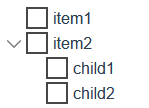

# Basic usage

The component can be included in a Vue-application either globally

```javascript
    import Vue from 'Vue'
    import { TreeVue } from 'vu-tree'
...
    Vue.use(TreeVue)
```

or locally:

```javascript
    import { TreeVue } from 'vu-tree'
...
export default {
  name: 'app',
  components: {
    TreeVue
  },
  data () {
...
```

The bare minimum of the component props that need to be set is `items`:

```html
  <template>
    <tree-vue
        :items="items"
    />
  </template>
```

By default every item has to have one prop only - `name`. And to get hierarchical structure another node prop is required - `children`.

```javascript
    import { TreeVue } from 'vu-tree'
...
export default {
  name: 'app',
  components: {
    TreeVue
  },
  data () {
    return {
      items: [{
        name: 'item1'
      }, {
        name: 'item2',
        children: [{
          name: 'child1'
        }, {
          name: 'child2'
        }]
      }]
    }
  }
...
```

